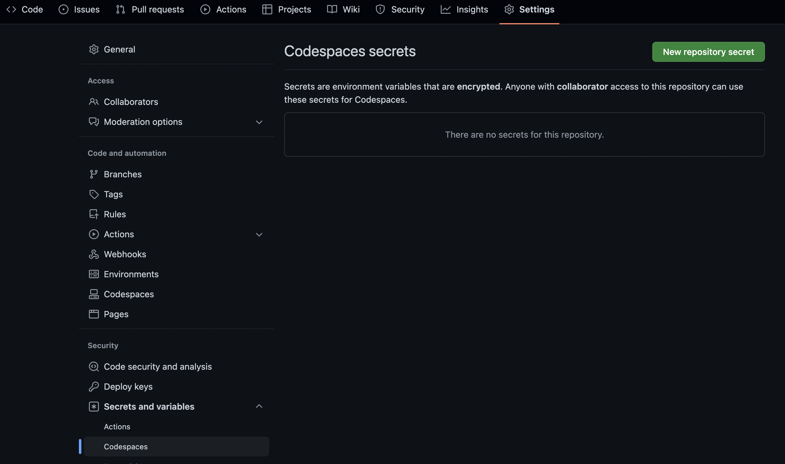

# llms_in_production_w2

## Note on OpenAI API Key
The course team will share with you an OpenAI API Key for this project. Please keep it safe and do NOT use it outside the context of the projects for this course. A few points to keep in mind: 

- Be mindful of usage so that we can continue to offer this shared resource.

- Once you’ve successfully completed your project, slow/stop your development to ensure that others in the class are able to complete their project.

To use the API KEY you can add it as a secret in your CodeSpaces. Navigate to Settings > Secrets and variables > Codespaces and add your API Key there. Give a key value `OPENAI_API_KEY`

